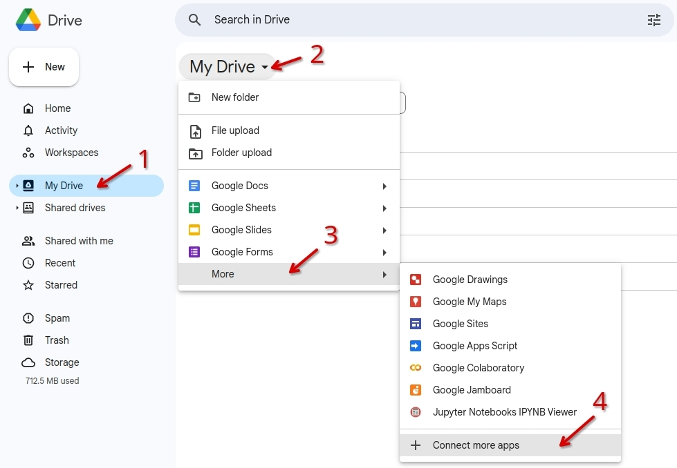
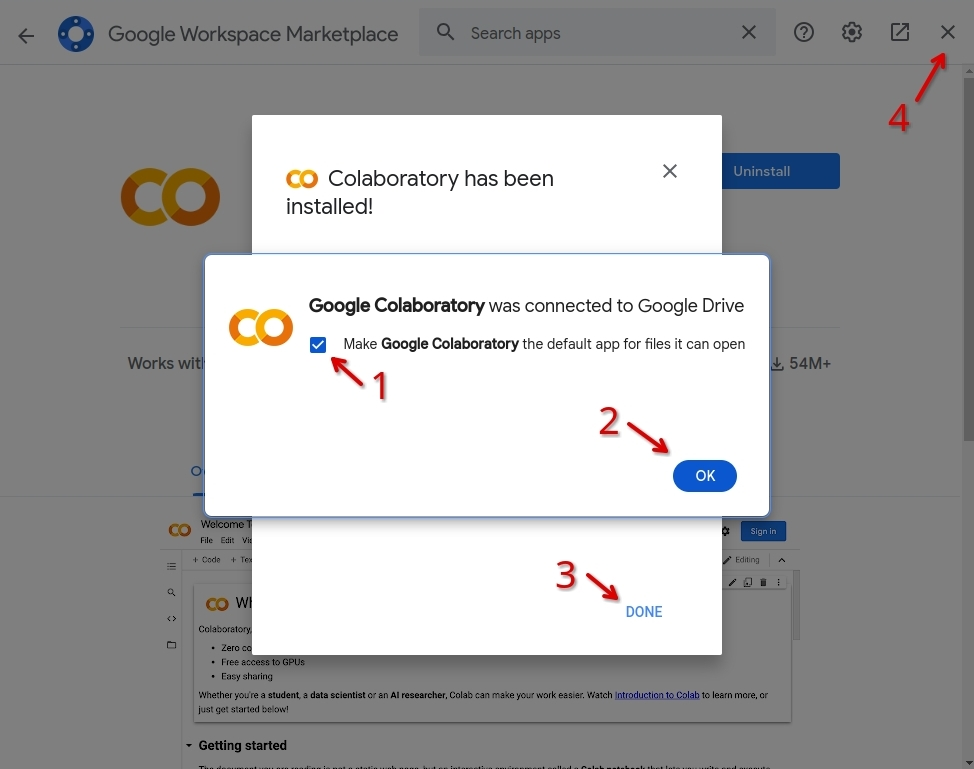
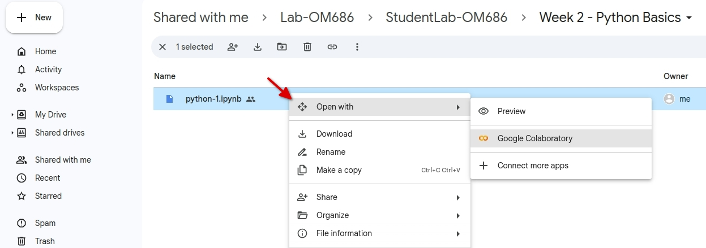

# Google Colab: A Free and Powerful Platform for Python Programming

Table of Contents

- [Google Colab: A Free and Powerful Platform for Python Programming](#google-colab-a-free-and-powerful-platform-for-python-programming)
  - [Introduction](#introduction)
    - [Key features](#key-features)
  - [Creating your first Colab notebook](#creating-your-first-colab-notebook)
    - [Step 1: Open Google Drive](#step-1-open-google-drive)
    - [Step 2: Install the Google Colab app](#step-2-install-the-google-colab-app)
    - [Step 3: Create a new Colab notebook](#step-3-create-a-new-colab-notebook)
  - [Exploring the Files panel](#exploring-the-files-panel)
  - [Accessing coding materials from Google Drive](#accessing-coding-materials-from-google-drive)

## Introduction

**Google Colaboratory** (**Colab**) is a free cloud service provided by Google Research that allows you to write and execute Python code in your browser. It provides access to computing resources, including GPUs, suitable for various tasks such as data analysis, machine learning, and running Python scripts. Since Colab is based on Jupyter, it supports many Python libraries and tools.

### Key features

- Seamless Collaboration: Enables real-time sharing and collaborative work, similar to Google Docs.
- Easy Integration with Google Drive: Allows you to store and access your notebooks directly from Google Drive.
- Compatibility with Python and its Libraries: Colab supports Python and its extensive ecosystem of libraries, making it suitable for a wide range of tasks.

## Creating your first Colab notebook

### Step 1: Open Google Drive

1. Go to the [Google Drive](https://drive.google.com/drive/home) page (<https://drive.google.com/drive/home>).
2. Make sure you are signed in with your **ualberta.ca** account.


### Step 2: Install the Google Colab app

1. Select "My Drive" on the left panel, then click "My Drive" on the top of the main panel.
2. On the opened menu, click "More".
3. Open the menu and click "More". If you see "Google Colaboratory" in the submenu, you can proceed to [Step 3](#step-3-create-a-new-colab-notebook). Otherwise, click "Connect more apps" on the submenu.



4. Once you select "Connect more apps", the Google Workspace Marketplace window will appear. In the search bar at the top, type "Colaboratory" and press *Enter*. From the search results, choose "Colaboratory".
5. From the search results, choose "Colaboratory".


6. Next, click "Install", then "Continue".


7. A Login window will pop up. Select your ualberta.ca account and wait for the app to be installed.


8. After installation, make sure that you have selected **Google Colaboratory** as the default app for files it can open, and click "Ok".

9. Press "Done" and close the Google Workspace Marketplace window.



Congratulations! You have successfully installed Google Colab.

### Step 3: Create a new Colab notebook

A *notebook* is an interactive document that contains code cells and text cells. Code cells are where you write and run Python code, while text cells are where you write explanatory comments or instructions.

To get started with a new Colab notebook:

1. Open the main menu on "My Drive" and click "More".
2. Select "Google Colaboratory" from the opened submenu.


3. You have now created a new Colab notebook. To edit the title, click on it and type "hello.ipynb". This name has the "ipynb" extension, which stands for Interactive Python Notebook. Jupyter Notebook uses this format to store documents.


4. The notebook contains a single empty code cell. You can execute Python code or shell commands using code cells. For example, let's write a simple code that prints "Hello, World!". First, click on the code cell and write the following code:

```python
print("Hello, World!")
```

5. To run the code in a cell, click the Play ▶ button at the top left corner of the code cell, or press *Ctrl + Enter*. This will execute the code and display the output below the cell.


- Running the above code will display "Hello, World!" in the output cell.


6. Now, let's add a text cell to the notebook. You can do this by clicking on the *+Text* button on the top bar or hovering your mouse over the current cell and selecting the *+Text* button.


7. Creating a text cell opens a text editor where you can write and format your text using markdown syntax. Next to your text, you can see a preview of the text cell.


- Colab notebooks can also run shell commands. Running shell commands allows you to execute commands from the operating system, such as installing packages, managing files, or accessing system information, without leaving the Colab notebook.

8. To see how it works, click on the *+Code* button on the top bar or hover your mouse over the last cell and select the *+Code* button.


9. Shell commands are preceded by an `!`. For example, `!pwd` prints the current working directory path. Let's check the Python version by writing the following command in the code cell you just created:

```bash
!python --version
```

10. This will display the version of Python being used, for example, `Python 3.10.12`.


Congratulations! You have successfully created your first Colab notebook. You can save your file by pressing *Ctrl + S* on your keyboard or by selecting *Save* from the *File* menu.


- The File menu offers other useful options such as *Locate in Drive* and *Save a copy in Drive*.
  - *Locate in Drive*: This option opens a new tab in your browser and shows you the location of the current Google Colab file in your Google Drive. You can then navigate to other folders or files in your Google Drive, or perform actions such as renaming, moving, copying, or deleting the file.
  - *Save a copy in Drive*: This option creates a duplicate of the current Google Colab file and saves it in your Google Drive. You can then choose a name and a location for the copy, or share it with others. This is useful if you want to keep a backup of your work, work on different versions of the same file, or share the current version with others.

## Exploring the Files panel

The Files panel allows you to organize and access your files.

1. Locate the "hello.ipynb" in your Google Drive and Open it in Google Colab.

> *Note*: You can open an IPYNB file located in Google Drive by double-clicking on it or selecting *Open with > Google Colaboratory* from the right-click menu.
> 

2. Click on the folder 📁 icon on the left panel to open The Files panel.


- The Files panel displays the files in the "/content" folder of your Google Colab space. You can access these files in your notebooks.

3. To upload files to this folder, click on the "Upload" button at the top of the panel. You can also use the right-click menu of the Files panel to upload files, create a new file, or create a new folder.


4. To download a file from your Colab space, click on the file name in the Files panel and select "Download".


- Google Colab also allows you to mount Google Drive to your Colab space, enabling you to access, import, and export your Google Drive files directly from your Colab notebook. This also syncs your Colab space and your Google Drive.

5. To mount Google Drive click on the "Mount Drive" button at the top of the Files panel.


6. A new popup window will ask for your permission to access your Google Drive. Choose "Connect to Google Drive".
7. A sign in window will show up. Pick your account from ualberta.ca.
8. After that, you will see a new folder "drive" in the Files panel. Open the "MyDrive" folder inside "drive" to view your Google Drive files.


## Accessing coding materials from Google Drive

You can access the coding materials for this course from Google Drive. To access these notebooks, do the following:

1. Open your [Google Drive](https://drive.google.com/drive/home) page (<https://drive.google.com/drive/home>) and ensure that you are signed in with your ualberta.ca account.
2. On the left panel, select *Shared with me*.
3. Select the course folder shared with you (e.g., "Lab-OM423").


4. Right-click on the folder and select *Organize > Add shortcut*.


5. On the new window, select the "All locations" tab, choose "My Drive", and press "Add".


- The folder is now successfully added to your *My Drive*!

6. To open the first IPYNB notebook of this course, open the course folder you added to *My Drive* and navigate to the "Week 2 - Python Basics" folder.

7. Right-click on the "python-1.ipynb" file and select "Open with > Google Colaboratory" from the menu. You can also open this file by double-clicking on it.



You are all set to start collaborating in Google Colab!
